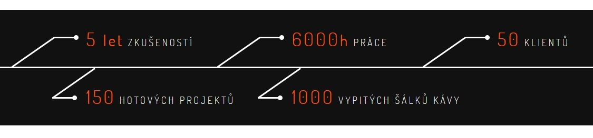

Káva se stala klíčovým elementem obchodních jednání. Argumentem pro setkání. Konverzačním ice breakerem. Ultimátním pracovním benefitem a nakopávákem. Předmětem uctívání a hádek. A dokonce unikátní marketingovou metrikou.

Kávová kultura pronikla tak hluboko do oblasti marketingu, že se z ní stal ukazatel kvality a úspěchů mnoha firem, agentur i jednotlivců.

## Marketingová káva

Nedávno mi dorazil newsletter od ředitele renomované společnosti, který obsahoval následkující větu: _„Od té doby jsme spustili 529 240 nových nabídek, zákazníci ohodnotili 6 053 050 voucherů a naše firemní kávovary uvařily 717 714 káv.“_

Respekt. Hromada nabídek, hromada voucherů. A počet uvařených káv? No dobře, respekt i kávovarům. Ale je to opravdu relevantní, hodnotná nebo vtipná informace?

Díky tomu newsletteru jsem si vzpomněl, že hlášku o počtu vypitých či uvařených káv jsem viděl už nesčetněkrát. Svého času ji totiž používal kde kdo. Možná někdy mezi roky 2010-2015 to ještě bylo relativně vtipné a originální. Kávová kultura tehdy byla žhavým trendem a všichni se přeháněli, kdo jí vypije víc.

## Síň kávy

Počet šálků vypité kávy se stal v minulých letech velice důležitou byznysovou metrikou. Obvykle se nachází v těsné blízkosti počtu hotových projektů a let zkušeností. Je to nekompromisní zrcadlo firem a úhelný kámen kvality marketingu. Níže je k vidění několik ukázek.

Udělali jste přes 200 projektů a máte přes 500 spokojených klientů? Vůbec není divné, že v referencích máte jen čtyři noname weby (z toho jeden je váš vlastní). Důležitější je jiná otázka. Jak je možné, že jste za 2 roky existence nevypili alespoň 2359 šálků kávy? Začátečníci…

## Kavárna U Nekreativního marketéra

Následující řádky budou možná překvapením. Drtivou většinu lidí, natož potenciálních klientů, vůbec nezajímá, jaké tekutiny a v jakém objemu vylučujete. A stejně tak se to má i s tekutinami, které požíváte. Je úplně jedno kolik kávy, vody nebo motorového oleje vypijete. Vůbec nic to nevypovídá o kvalitě odvedené práce, znalostech zaměstnanců nebo spokojenosti klientů.

Hláška o počtu vypitých káv je často k nalezení na webech marketingových a vývojářských agentur. Jediné, o čem vypovídá, je naprosto zoufalý nedostatek kreativity. A troufám si říct, že marketing se bez alespoň špetky kreativity dělá docela špatně.

Relevantní případy, kdy by dávalo smysl se pochlubit počtem uvařených káv, jsou například vlastnictví kavárny nebo prodej kávovarů.

Ani ty další čísla nemají zrovna hluboký význam. Počet klientů, odpracovaných hodin ani hotových projektů vůbec nic neznamená. Všechno jsou jen náhodná čísla, která mají za úkol vyvolat iluzi důvěryhodnosti a nalákat klienty.

## Tak trochu jiný šálek kávy

Když už káva, tak se pojďme bavit také o méně příjemných souvisejících tématech – ekologie, udržitelnost a vykořisťování.

Kávovar jede na plné obrátky, kafe teče proudem a v koši se hromadí jednorázové hliníkové kapsle. Hliník lze recyklovat donekonečna s relativně nízkými náklady. Kapsle se vyrábí převážně z již recyklovaného hliníku. Někteří výrobci mají na recyklovatelný odpad sběrná místa.[^1] Ale kolik firem recyklaci kapslí skutečně poctivě řeší?

Vypité šálky chlubivé marketingové kávy jsou dost možná výsledným produktem dětské práce a vykořisťování zemí třetího světa. Kolik lidí klade důraz na nákup fair trade produktů? Nebo je to jedno, hlavně když dostanu denní dávku kofeinu?

Namísto prázdného sdělení a hloupé metriky se dá věnovat prostor alespoň drobnému náznaku společenské odpovědnosti. Klidně v souvislosti s milovanou kávou. Bylo by to mnohem přínosnější. Sdělení, že je firma ekofriedly nebo podporuje fair trade, mi osobně přijde jako poutavější. A nemusím být nezbytně nutně ekoterorista, abych to ocenil.

## Poslední kafe před koncem

Nevypilo se marketingové kávy už dostatek? Buďte originální. Není to až tak náročné. Jako náhražka poslouží alespoň drobný náznak společenské odpovědnosti. Nebo cokoliv relavatního k byznysu, který reálně provozujete. Prodáváte weby nebo kafe? A už jste někdy přemýšleli, jestli by vám to kafe čirou náhodou nešlo lépe?

Pokud jste na straně klientské, zvažte, zda je káva ta správná metrika, podle které dává smysl vybírat dodavatele webu a marketingových aktivit.

## Poznámky pod šálky

[^1]: Informace o kávových kapslích pochází z podzimního vydání časopisu Forbes NEXT ze článku _„Kam s tou kapslí?“_. Citace: MANDAUSOVÁ, Klára. Kam s tou kapslí? _Forbes NEXT_. 2020, (3), 104. ISSN 2570-4869.
