V květnu 2020 jsem se začal věnovat pixel artu. Tento blog budu využívat jako nástroj pro sebemotivaci a dokumentaci pokroku.

Původně jsem začal zkoušet 3D grafiku v Blenderu. Po několika pokusech jsem vyhodnotil, že bude lepší se pustit do něčeho méně ambiciózního s možností rychlejšího postupu a nutností méně komplikovaného softwaru. A nic "jednodušího" než pixel art není.

Základy a prvotní inspiraci jsem načerpal z několika YouTube kanálů. Převážně kanály [Brandon James Greer](https://www.youtube.com/channel/UCC26K7LTSrJK0BPAUyyvtQg) a [Pixel Pete](https://www.youtube.com/user/MilkoDaily). Pro tvorbu grafiky nyní používám trial verzi nástroje [Marmoset Hexels](https://marmoset.co/hexels/) (viz video níže).


  
<iframe src='https://www.youtube.com/embed/XDbURCvRI6w' frameborder='0' allowfullscreen></iframe>



Všechny obrázky v článku jsou zvětšené a uváděné rozměry odpovídají originálu. Reálnou velikost 32x32 pixelů demonstruje ukázkový čtverec níže.

## První pokusy

**Pavoukovitá věc**. Náhodné kreslení a experimenty. Plátno 32x32 px.

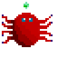

**Dům**. Náhodné kreslení a experimenty. Nedokončeno. Rozhodl jsem se věnovat jednodušším objektům dle reálné předlohy a získat nejdříve více cviku. Plátno 32x32 px.

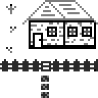

**Nintendo Switch**. Inspirováno tutorialovým videem. 32x14px.

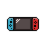

**Gameboy Color**. Kresleno dle obrázkové předlohy. Flat verze a pokus o perspektivu. Rozměr flat verze 14x23 px.

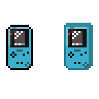

**Medvěr Wrr**. Klesleno dle reálné předlohy. Velikosti 10x16 px a 20x28 px. Minimální realizovatelná velikost a velikost umožňující přidat více detailů.

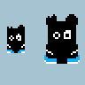

## Monster series

**Chapadlo**. Obyčejné chapadlo a verze s přísavkami/ostny. Plátno 32x32 px.

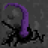 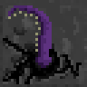

**Blob**. Mini série tří obrázků: blob, prasklý blob, hmyzí příšera na scéně. Plátno 32x32 px.

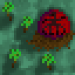 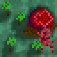 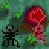

## Zen series

**Zenové relaxační pískoviště**. Inspirováno videem o pixel art nábytku. Na obrázku se nachází box s pískem, černý kámen a hrabičky na písek. Plátno 32x32 px.

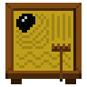

**Koi bazének**. První pokus o animaci. Na obrázku se nachází most a bazének se třemi Koi. Ryb původně bylo 5 a byly zvýrazněny vlny tvořené jejich pohybem. Animace je časově hodně náročná, proto zatím jen tři nepříliš kvalitně animované ryby a bez vln. Budu pravděpodobně ladit v dalších iteracích. Plátno 32x32 px, 30 framů.

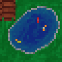

**Čajový set Yixing**. Na obrázku se nachází čajové moře, tři šálky, konvička a šálek s lístky zeleného čaje. Plátno 64x32 px.

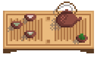

## Závěr

Mám za sebou přibližně 10 dnů experimentů a spoustu nových nápadů ke zpracování. Vytvoření jednoho obrázku trvá kolem 20 minut. Ladění drobných detailů, stínování, výběr vhodnější barvy pak zabere dalších 30-60 minut.
