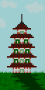
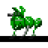
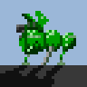
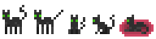

Nové experimenty s pixel artem. Zkusil jsem se pustit do pár složitějších obrázků i do jednoho minimalistického kousku. Všechny obrázky v článku jsou 2x/3x zvětšené a uváděné rozměry odpovídají originálu.

## Zen series

**Buddhistický mnich**. První verze a mírně upravená verze se stínem. Plátno 32x32 px.

 

**Pagoda**. Tři velikosti. Originál, 2x zvětšené, 3x zvětšené. Nejlépe funguje originální verze, na které nejsou vidět nedostatky a chybějící detaily, které nebylo možné do obrázku dostat. Plátno 64x32 px.

  

## Experimenty

**Kosmik**. Vesmírné vozítko Starbug 1 ze seriálu Červený trpaslík. První verze a upravená verze s pozadím a stínem. Plátno 32x32 px.

 

**Kočičáci**. Mini série s minimalistickou kočkou. Normální, vystrašená, sedící zepředu, sedící zboku, v pelíšku. Plátno 32x64 px.

## Závěr

Méně času, méně obrázků. Vypršel mi trial na nástroj Marmoset Hexel a přesouvám se k testování dalšího specializovaného software na pixel art. 
