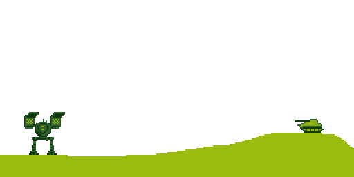

Po vypršení trial verze Marmoset Hexels jsem zkusil koupit za pár korun licenci na nástroj Aseprite. Specializovaný grafický software na pixel art, který používá většina tvůrců.

## Aseprite

Výhody, které Aseprite nabízí jsou poměrně zásadní. Mnohonásobně efektivnější nástroje pro kreslení, výrazně lepší tvorba animací, předpřipravené barevné palety.

Na druhou stranu není příliš intuitivní, není customizovatelný a má nezvyklé kláveské zkratky. Takže mě zatím spíše vrhl o kousek zpátky ve tvorbě. Většinu prvních pokusů jsem rovnou zahodil.

Nakonec jsem zakotvil u experimentování se dvěma minimalistickými paletami barev.

## Mech series

**Game Boy paleta**. Čtyři odstíny zelené. Hry v těchto barvách jsme mohli hrát od roku 1989. Paleta umožňuje dobrou práci se stínováním a zvýrazňováním.

**Catapult**. 2x LRM20. Plátno 32x32 px.

**Awesome**. 3x PPC. Plátno 32x32 px.

**Uziel**. 1x SRM6, 2x Heavy Machine Gun. Plátno 32x32 px.

**Catapult VS tank**. Animovaný gif. Catapult vystřelí rakety a zničí tank. Plátno 256x128 px.

## Náhodné pokusy

**ARK4 paleta**. Bílá, černá, dva odstíny fialové. Poměrně náročné na použití. Bílá a černá jsou příliš kontrastní a práci spíše komplikují.

**Nábytek a interiér**. Dvě různé skříně, postel, (nepovedený) počítač, otevřená lednice, kuchyň (s mikrovlnkou, vodovodní baterií a kávovarem), záchod a nakonec rituální pokoj s lebkou a svíčkami. 32x256 px.

## Závěr

Celkově není Aseprite špatný, ale bude trvat, než si na něj pořádně zvyknu. Uvidím co přinese další kreslení.
