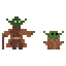

Zatím mi moc nešlo kreslení postav, tak jsem se zaměřil primárně na to a jako předlohu si vybral postavy ze Star Wars. Plus jsem zkusil pár animací.

## Star Wars postavy

**Luke Skywalker**. Košile a kalhoty jsou světle modré, aby oblečení vyniklo na bílém pozadí. Plátno 32x32 px.

**Darth Maul**. Plátno 32x32 px.

**Java**. Plátno 32x32 px.

**Chewbacca**. Plátno 32x32 px.

**Yoda & baby Yoda**. Plátno 32x32 px.

## Animace

**Luke Skywalker**. Animace chůze mi moc nešla a byl jsem líný si s tím více pohrát, tak jsem zkusil něco jednoduššího. Třeba salto. Plátno 256x128 px. 30 framů.

**Luke Seawalker**. A když už jsem byl v tom, tak jsem trochu potrápil Luka a hodil ho do vody. Plátno 256x128 px. 30 framů.

**Luke Lavawalker**. Možná jsem Luka potrápil trošku víc, než jsem původně plánoval. Prostě jsem hrozně chtěl zkusit udělat lávu (nad fakt hezkou animací, bych ale musel strávit asi tak 3 hodiny). Plátno 256x128 px. 30 framů.

**Luke Groundwalker**. Chudákovi se prostě nedaří zabít ani nudu. Chtělo by to nejdřív více praxe s tréningovým mečem. Plátno 256x128 px. 35 framů.

## Závěr

Konečně jsem si pořádně zvykl na Aseprite a udělal větší pokrok v animacích. Nakreslit postavu trvá cca 15-30 minut. Udělat animaci cca 60-90 minut. Příště budu zkoušet tvořit alespoň trochu použitelné sprity do nějaké minihry.

Jako inspiraci jsem si našel tohle video:


  
<iframe src='https://www.youtube.com/embed/wBxA_ITtJxw' frameborder='0' allowfullscreen></iframe>



A už jsem v několikrát zmínil software Aseprite, ale ještě jsem nepostnul, jak vlastně vypadá, takže pro zájemce krátké video:


  
<iframe src='https://www.youtube.com/embed/eG6AJcj5KTY' frameborder='0' allowfullscreen></iframe>


