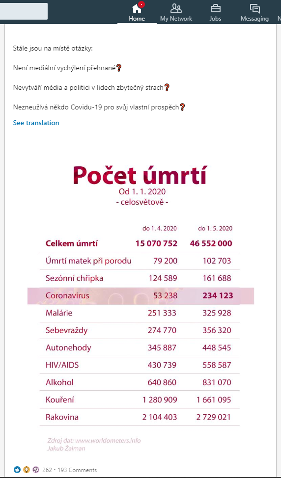
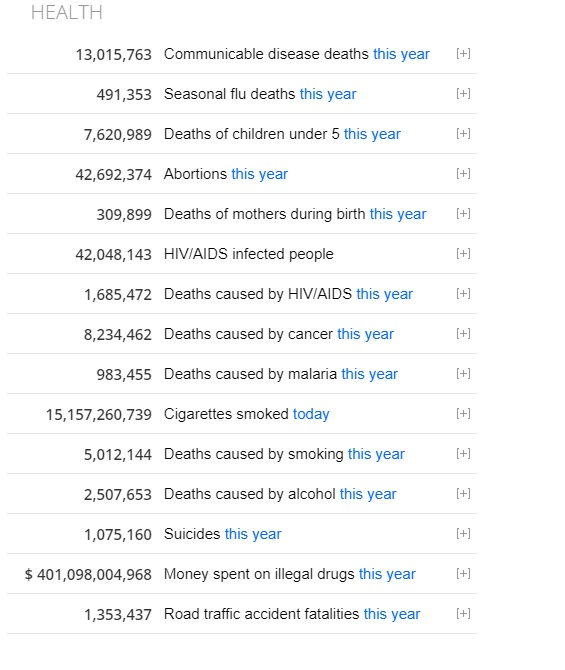

Tabulky porovnávající počet úmrtí na coronavirus například s počtem sebevražd se začaly ve velké míře objevovat na jaře 2020. Všechny pochází z webu worldometers.info a nejsou ani trošku validní. Po několika bezvýsledných diskuzích jsem se rozhodl udělat důkladnější průzkum a sepsat poznatky do článku.

Jen stručná poznámka na úvod, ať jsme na jedné vlně. Tento článek nijak nekomentuje a nehodnotí vládní opatření, šíření coronaviru, nošení roušek atd. Text je zaměřený jen a pouze na validitu dat z webu Worldometers a upozorňuje na šíření dezinformací.

## O co jde

Na tabulky porovnávající počet úmrtí na coronavirus s úplnými nesmysly jste dost pravděpodobně už natrefili. Zajímavé je, že se vždy jedná o plus mínus stejný mix příčin úmrtí - coronavirus, sebevraždy, autonehody, chřipka, malárie atd. Vysvětlení je velice prosté.

Data pochází z jednoho zdroje, kterým je web https://www.worldometers.info. Ten nabízí výběr omezený pouze na několik málo náhodných možností, který se autorům webu zrovna hodily do sekce *Zdraví* na titulní stránku. Šiřitelům dezinformací to ale bohatě stačí a výborně jim hraje do karet.

## Ukázka

Jak vypadá parádní dezinformace založená na datech z Worldometers můžete vidět na screenshotu níže. Co je špatně? Úplně všechno. Postupně rozeberu.

 \
*Zdroj obrázku: Screenshot z LinkedInu*

## Porovnávání neporovnatelného

Porovnávat statistiku sebevražd s úmrtím na coronavirus je jako porovnávat jízdu na kole s kuřecím vindaloo na oběd. Z obou vás bude večer pálit zadek. A tím asi tak podobnosti končí. Výsledek práce se vzájemně nekompatibilními daty nemůže být nikdy validní.

**Coronavirus**, je obecné označení rodu virů způsobujících infekční virové onemocnění. V tomto případě je pravděpodobně spíše myšleno onemocnění covid-19. Virus je přenositelný vzduchem a kontaminací povrchů.

**Chřipka** je infekční virové onemocnění. Virus je přenositelný vzduchem a kontaminací povrchů.

**Malárie** je parazitární infekční onemocnění. Hlavním přenašečem je hmyz vyskytující se v tropických oblastech.

**HIV/AIDS**. Snad ani není nutné komentovat.

**Sebevraždy**, **autonehody**, **alkohol**, **kouření**, **rakovina**, **úmrtí matek při porodu**. Tohle přece nikdo příčetný nemůže dávat do souvislosti s čímkoliv.

Jednou je uvedeno obecné označení virů. Podruhé choroba, kterou způsobuje úplně jiný virus. Potřetí choroba s úplně jiným způsobem přenosu. K tomu mix běžných příčin úmrtí.

Celé to je absolutně mimo mísu. Navíc sebevraždy nebo autonehody stejně jako mnohé jiné uvedené příčiny úmrtí nejsou infekční. Za normálních okolností se jedná o jevy, u kterých je růst celkového počtu úmrtí víceméně lineární.

**Varování**. Pokud se nechráněni rouškou a celotělovým ochranným oblekem dotknete havarovaného auta, ve kterém v předchozích 48 hodinách zemřeli lidé, je silně pravděpodobné, že jste infikováni a do několika dnů zemřete vy a vaši blízcí při autohavárii. Prosím, dostavte se neprodleně na nejbližší termín IQ testů ve vašem městě. S výsledky si následně u soudu zažádejte o zbavení svéprávnosti.

## Nevalidní data

Pokud pro vás není dostačující premisa, že tabulka porovná totální nesmysly, tak následující řádky by vás převědčit měly.

### Celkové součty

Dle screenshotované tabulky od 1. 1. 2020 do 1. 4. 2020 celosvětově na různé příčiny zemřelo 15 070 752 lidí. Od 1. 1. 2020 do 1. 5. 2020 pak zemřelo celosvětově 46 552 000 lidí. To tedy znamená, že pouze za duben 2020 údajně zemřelo **31 481 248 lidí**.

To je 2x více než za předchozí 4 měsíce dohromady. A téměř 2x více než zemřelo lidí v 1. světové válce. Někde ve světě pravděpodobně musela vypuknout strašlivá katastrofa, o které všechna média mlčely. Asi v tom budou mít prsty zase ti zatracení Ilumináti. Nebo někdo opsal chybně čísla a díky nedostatku sebereflexe si nedokázal takovou chybu připustit. Ale to se stává jen zcela výjimečně. Osobně fandím Iluminátům.

### Identický růst

V následující tabulce se detailněji zaměřuji na uváděné hodnoty jednotlivých příčin úmrtí. Ze screenshotu jsem si opsal číselné hodnoty a trochu je propočítal. Prosím, pozornost věnujte poslednímu sloupci s názvem **meziměsíční růst**.

| x_x | stav k 1. 4. 2020 | stav k 1. 5. 2020 | **meziměsíční růst** |
| :------ |:--- | :--- | :--- |
| Úmrtí matek při porodu | 79 200 | 102 703 | **29,676 %** |
| Sezónní chřipka | 124 589 | 161 688 | **29,777 %** |
| Coronavirus | 53 238 | 234 123 | 339,767 % |
| Malárie | 251 333 | 325 928 | **29,68 %** |
| Sebevraždy | 274 770 | 356 320 | **29,679 %** |
| Autonehody | 345 887 | 448 545 | **29,68 %** |
| HIV/AIDS | 430 739 | 558 587 | **29,681 %** |
| Alkohol | 640 860 | 831 070 | **29,68 %** |
| Kouření | 1 280 909 | 1 661 095 | **29,681 %** |
| Rakovina | 2 104 403 | 2 729 021 | **29,681 %** |

Vidíte to taky? Snad ano. Abyste pochopili, proč je všude prakticky shodný růst přibližně o 29,7 %, je potřeba udělat větší odbočku a trochu zapátrat v dalších informacích.

#### Kde bere Worldometers data I

Pro přehlednost rozdělím data z Worldometers do tří kategorií, které popíšu. 1) Data z primárních zdrojů. 2) Odhadovaná data (WHO, CDC a další). 3) Data bullshitózní.

1) **Data z primárních zdrojů** představují statistiky kolem coronaviru a COVID-19. Data totiž pochází z oficiálních zdrojů a reportů zemí po celém světě. Čísla jsou pravidelně aktualizovány a zdá se, že skutečně odpovídají tomu, co dané země reportují. (Spekulovat zda všichni reportují dle pravdy zde ovšem nechci. Například všichni moc dobře víme, že hrdý a bohatý národ Severní Koreje je natolik vyspělý, že si tam virus ani neškrtne.)

Ještě existují další data z čerpaná z primárních zdrojů a to jsou statistiky populace. Ty Worldometers bere z webů [https://databank.worldbank.org/](https://databank.worldbank.org/) a [https://population.un.org/wpp/](https://population.un.org/wpp/).

2) **Odhadovaná data (WHO, CDC a další)**. Tato kategorie pokrývá různé statistiky k příčinám úmrtí jiných než coronavirus. Tedy například chřipka, sebevraždy, malárie, rakovina, autonehody atd. Worldometers u uváděných statistik sice odkazuje na zdroje, ty ovšem přesná čísla vůbec neobsahují. Pokud zdroje čísla obsahují, tak se často jedná o několik let staré dokumenty obsahující pouze expertní odhady. Žádná oficiální čísla často nejsou k dispozici. Natož z aktuálního roku a už vůbec ne každodenně aktualizovaná. Historická čísla jsou zpravidla uváděny jako hrubé odhady. Takže, kde se berou denní statistiky?

#### Úmrtí zapřičiněná dopravními nehodami

Vysvětlení najdeme například u počtu úmrtí, kde je příčinou dopravní nehoda. Worldometers  odkazuje na zdrojový web who.int, který uvádí v článku [Global launch of the Decade of Action for Road Safety 2011-2020](https://www.who.int/mediacentre/events/meetings/2011/road_safety/en/) z 11. května 2011 následující predikci: *"...current level of nearly 1.3 million deaths annually to more than 1.9 million deaths per year by 2020."*

Z dříve uvedené tabulky a řádku autonehod vyplývá, že každý měsíc přibyde cca 102 658 úmrtí plus mínus cca 7500. Rozdíl sedmi a půl tisíce je hodně. Je to způsobené tím, že není jasné v jaký čas si autor tabulky opsal čísla.

102 658 vynásobeno dvanácti je **1 231 896** úmrtí. Podezřele se výsledek blíží informaci z webu WHO z roku 2011. Je to skutečně i číslo, které na worldometers.info uvidíme koncem roku? Není, ale skoro.

Číslo, které na konci roku (letošního, příštího a nejspíš i dalších) na worldometers.info bude k vidění 31. 12. 2020 v čase 23:59:59 u dopravních nehod bude cca 1 354 200. Stanovený denní přírůstek, ke kterému jsem totiž dospěl by měl být 3700 úmrtí. Čísla jsem získal přímo z worldometers.info, kterému jsem podvrhul falešné systémové datum a čas. Více k tomuto později.

Co na to číslo říkají zdroje, které se již Worldometers uvést nenamáhal? Web who.int uvádí na stránce [Global Health Observatory (GHO) data - Number of road traffic deaths](https://www.who.int/gho/road_safety/mortality/traffic_deaths_number/en/) informaci *"There were 1.35 million road traffic deaths globally in 2016."* Dokument WHO s názvem [Global status report on road safety 2018](https://www.who.int/publications/i/item/global-status-report-on-road-safety-2018) pak uvádí v předmluvě na straně vii větu *"This report shows that the problem is getting worse. Deaths from road traffic crashes have increased to 1.35 million a year. That’s nearly 3 700 people dying on the world’s roads every day".*

Je tedy zřejmé, jak Worldometers počítá "statistiky". Obdobně se dá dopátrat i k dalším číslům a očekávaným výsledkům. Tam, kde WHO, CDC či jiná autorita uvádí nějaké rozpětí hodnot, lze jednoduše spočítat medián, pomocí kterého se opět dá dostat k velmi podobným číslům jako jsou "aktuální" Worldometers statistiky.

Klíčová slova, která Worldometers často uvádí u popisu dat jsou **historical trends**, **projections** a **estimate**. Jedná se tedy o čísla generované pomocí odhadů založených na historických trendech založených na odhadech a nepřesných číslech.

#### Kde bere Worldometers data II

3) **Data bullshitózní** jsou poslední kategorií, která ve skutečnosti zahrnuje předchozí kategorii založenou na reálně neexistujích datech WHO či CDC. Většina údajů na webu Worldometers jsou s vysokou pravděpodobností jen velmi hrubé odhady čili výmysly.

### Zpět k lineárnímu růstu

Pamatujete si ještě trochu tabulku a hodnotu 29,7 %. Vysvětlení je jednoduché. Buď je jasně daný finální výsledek nebo každodenní přírůstek. Tak či tak, procentuální růst za vybrané časové období tedy bude vždy u všech příčin úmrtí logicky stejný. Absolutně nijak nevypovídá o reálném stavu. Uváděná čísla z neexistujícího zdroje nejenže nemá smysl porovnávat s coronavirem, nemá smysl je porovnávat ani mezi sebou. Jsou to jen smyšlené silně orientační hodnoty.

### Algoritmy

Realita je taková, že Worldometer neukazuje žádný skutečný růst. Pravděpodobně ani nepoužívá žádné skvělé sofistikované algoritmy. Ani nemusí. Jak jsem již dříve ukázal. Výsledek a růst je předem jasně daný. Po vstupu na stránku se spustí JavaScript, který zjistí aktuální datum a čas systému uživatele. Dle toho nastaví počáteční hodnoty a začne dopočítávat fiktivní "statistiku" pro letošní rok.

Worldometers používá pro zobrazení dat JavaScript a JSON. Soubory jsou šifrované a bez znalosti primárního dešifrovacího klíče jsou k ničemu a není možné nic moc verifikovat. Na svém webu Worldometers uvádí následující slova, kterými popisuje mechnismus za zobrazenými daty: *"...proprietary algorithm which processes the latest data and projections..."* To zní moc hezky. Ale může to znamenat téměř cokoliv. Odpočet/dopočet je také algoritmus a zvládne ho vytvořit i školák na základce. Nic sofistikovaného netřeba. Neprůstřelné důkazy bohužel nemám jak získat.

### Historie a transparentnost

Všechno výše uvedené je i zjevný důvod, proč Worldometers nemá žádný archiv a nezobrazuje vývoj hodnot za jakékoliv předchozí období. Podezřele linérní vývoj by byl zjevný okamžitě.

Nepomůže ani Internet Archive Wayback Machine. Zobrazení dat zajišťuje již dříve zmíněný script. Ten se pouze přizpůsobí datu z Web Archivu. Nevidíme tedy archiv ale pouze číslo, které script přizpůsobil pro vybrané datum z Web Archivu.

Celkem jednoduše se dá ale změnit systémový čas a získat tak čísla, která uvidíme na konci roku na titulní straně worldometers.info. Screenshot níže byl pořízen v simulovaném čase kolem půlnoci 31. prosince 2020.

Je ovšem i dost dobře možné, že se do té doby změní výchozí hodnoty na základě nějakého nového dokumentu od zdroje typu WHO či CDC.

## Poukazování na chyby médií

Mnoho z těch, kdo sdílí tabulky z Worldometers přihazují k dobru poznámky o "roli médií v době krize". Za všechno mohou média, dělají to blbě, ten problém přece není tak velký a tak dále.

Sdílíte cokoliv na sociálních sítích nebo webech? Ano? Překvapení! Také plníte roli informačního média. Zpravodajství a velké mediální domy jen zrcadlí a zvětšují obraz, který sami vytváříme. Bohužel.

Sdílíte cokoliv o coronaviru nebo covid-19? Ano? Nečekaně situaci přiživujete a ukazujete médiím, že o tom mají psát ještě víc.

Mediální domy jsou primárně továrny na peníze. Peníze nepřináší decentní poctivé zpravodajství. Oproti tomu šokující zprávy a porovnání blbostí, které davům přijdou tak super a srozumitelné, vydělají mediálním magnátům na dovolené a nákupy.

## Argumentace není možná

* Já přece neporovnávám coronavirus a sebevraždy, jen ukazuju rozdíly mezi počtem úrtí...
* Ta tabulka je jen ilustrační...
* Covid není problém, sebevražd je víc...
* Ale já jsem jenom...
* S vámi se nebudu bavit, to nemá smysl, vy tomu totiž vůbec nerozumíte...
* Opsal jsem to z Worldometers, protože to tam takhle je...
* Jiný zdroj jsem nenašel...
* Viděl jsem to na Novinkách, takže to musí být pravda...
* Je to na internetu, takže to musí být pravda...

Diskuze s někým, kdo srovnává covid-19 a sebevraždy, je téměř nemožná. Totéž platí o výše uvedených argumentech. Tito lidé většinou preferují pouze souhlasné komentáře uživatelů, se kterými se mohou virtuálně poplácat po zádech. Ani pod tíhou jasných důkazu a argumentů nejsou ochotní ustoupit ze svého názoru nebo opravit naprosto zjevné chyby, na které byli několikrát upozorněni. Respektive jakékoliv argumenty trvale ignorují.

Moment, kdy je autor upozorněn na chyby a i nadále je vytrvale ignoruje a nechává cíleně žít, je chvíle, kdy vzniká účelová dezinformace.

## Závěrem

Worldometers.info byl do roku 2020 naprosto zbytečný web, který zprostředkovával nevalidní pseudo-statistiky. Popularitu nabral především díky publikaci aktuálních dat a informací o situaci s coronavirem. V tomto ohledu vykonává celkem záslužnou činnost (a pochopitelně díky tomu vůbec nevydělává statisíce za zobrazování reklam).

Bohužel tvůrci webu uváději často zcestné informace a tváří se na první pohled, že čerpají ze zdrojů, které ve skutečnosti neexistují. Smutné je, že tyhle informace a data přebírají bezmyšlenkovitě lidé i média v honbě za senzací.

Rychlý souhrn na závěr:

* Worldometers zobrazuje náhodná čísla k různým věcem, mezi kterými nejsou žádné souvislosti.
* Statistiky jsou smyšlené předem dané hodnoty, které nemají nic společného s realitou.
* Data z různých zdrojů není možné porovnávat.
* Nevalidní data není možné porovnávat.
* Dvě zcela rozdílné věci není možné datově porovnávat.
* Pokud cíleně šíříte falešné informace jste dezinformátoři.

## P.S. FAQ

Odpovědi na komentáře a dotazy, které jsem dostal.

**S čím tedy porovnávat?**

Nevím, nejsem expert na danou oblast. Toto by měli řešit výhradně odborníci na problematiku příslušných oborů, například (evoluční) epidemiologie, virologie atd.

**Ale porovnat statistiku úmrtí na coronavirus a třeba autonehody nějaký smysl dávat může, ne?**

Pokud pominu, že to je stále nesmysl, tak teoreticky ano. Pro demonstraci a čistě porovnání dat. Ale je poměrně klíčové, jakým způsobem je to prezentováno. Ze správně prezentovaných dat by totiž mělo na první pohled jasně vyplynout, že coronavirus je rychle rostoucí nový nepoznaný problém. Počet úmrtí při dopravní nehodě je dle informací od WHO stabilní a mezi roky 2011-2018 meziročně nerostl tak, jak bylo očekáváno.

Ještě jednou. Klíčové je kontext, detaily a explicitní interpretace. Nějaká tabulka sama o sobě nic nevypovídá, i kdyby v ní byly validní data z nejlepších zdrojů. Dejte stejnou tabulku 10 lidem a dostanete minimálně 10 rozdílných interpretací co data znamenají.

Podobné jednoduché tabulky jsou nebezpečným nástrojem pro manipulaci s veřejným míněním. Záměrně jsou zavádějící, vytržené z kontextu a nedostatečně okomentované. Mnoho lidí si je vyloží tak, že coronavirus není problém, což je pravděpodobně účel. A autor je z obliga, protože nic takového nikde nenapsal. Že lidé data interpretují jinak než sám zamýšlel není pochopitelně jeho problém.

**Je správné ukázat, že lidé umírají i na jiné příčiny než coronavirus.**

Že lidé stále umírají i na jiné příčiny než coronavirus chápe i člověk s lehkou mentální retardací a některými formami středně těžké mentální retardace. Na tohle je nutné upozorňovat snad jen pravidelné diváky TV Barrandov.

**Ale z některých dat vychází, že coronavirus není až takový problém, jako jiné civilizační problémy.**

Možná ano. Uvědomte si, že bez pravidelné dávky informací, osvěty a některých protiopatření by byl coronavirus nepředstavitelně větší problém.

**Může být období, kdy budou sebevraždy růst exponenciálně.**

Jistě se to stát může. Ale pandemie sebevražd se pravděpodobně nedočkáme. Leda by soudruzi v Číně zvládli pomocí genetického inženýrství vyrobit oliheň beznaděje.

**Ale opatření vlády...**

Ano, některá opatření a jednání vlády možná nebyly nejšťastnější. Bohužel. Prosím, podívejte se i co se dělo/děje jinde. Snad všechny vlády po celém světě dělaly chyby a jednaly zmateně. Tahle diskuze sem ale nepatří. Článek je o datech.

**Metodika měření kolem koronaviru je špatná.**

Ano, metodika se změnila tolikrát, že data nejsou validní. To je problém. V čase se ovšem můžeme pohybovat pouze vpřed a data už zpětně nelze dopočítat správnou a jednotnou metodikou. V tomto případě je nutné se smířit s tím, že dostupná data ke coronaviru a covid-19 sice nejsou validní a kompletní, ale nic jiného už nikdy mít k dispozici nebudeme. Ale alespoň to nejsou úplně náhodná čísla spočítaná JavaScriptovou kalkulačkou.

**Cokoliv...**

Znovu zde zopakuji jednu úvodní větu. Text je zaměřený jen a pouze na validitu dat z webu Worldometers.info a upozorňuje především na šíření dezinformací.

Nenavrhuji žádná řešení. Nekritizuji žádná konkrétní opatření. Na to moje expertíze není ani zdaleka dostačující.
