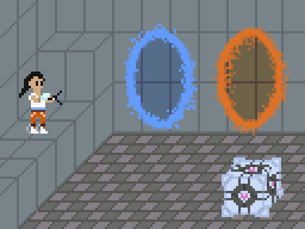
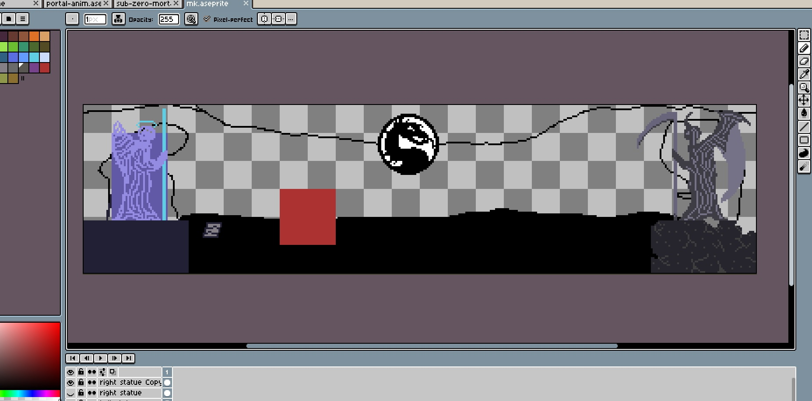
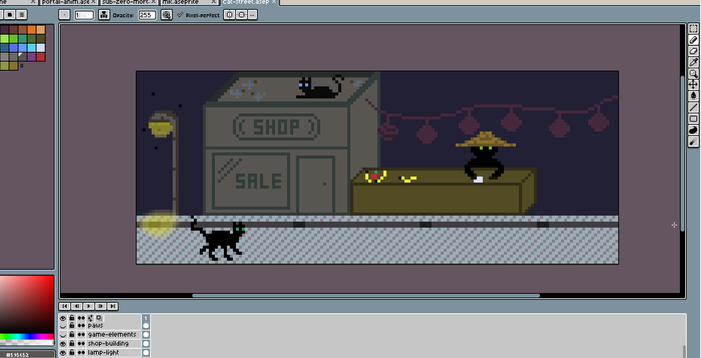

Pár nových kousků a experimentů. Tentokrát primárně zaměřeno na hry.

## Portal

**Portal animace**. Pokus o iluzi 3D prostoru. Animace portálů vznikala nadvakrát. První hezčí verzi animace portálů jsem omylem smazal a druhou jsem lehce odfláknul. Nejnáročnější bylo vytvořit Companion Cube, což trvalo skoro stejně dlouho jako zbytek obrázku.



## Mortal Kombat

**Sub-Zero**. Rychlý pokus o vytvoření postavy z Mortal Kombat. 32x32 px.


**Mortal Kombat**. Vytvořit pixel art art arénu se ukázalo být jako docela ambiciózní. Od projektu jsem upustil.



## Cat Alley

**Kočičí ulička**. Náhodný nápad na vytvoření nějaké kočičí hry mě inspiroval k vytvoření alespoň jednoduché scény a animace. Zatím jen draft, který postupně dodělávám a experimentuji s různými prvky. Většina objektů slouží spíše jako placeholdery a budou přepracovány.



## Memory Game - pexeso

Všechno postupně míří ke tvorbě her. To jsem si vyzkoušel na vytvoření pexesa dle tutorialu pro Unity. Pro hodně odvážně, první build (fakt špatné) hry pro Windows je zde: [pexeso-demo-v1.zip](../assets/posts/2020-09-14-pixel-art-v/pexeso-demo-v1.zip "pexeso-demo-v1.zip") (18 MB). Rozbalit a spustit souborem ```pexeso-test.exe```.


## Závěr

Příště chci mít hotovou kresbu kočičí uličky i s animací. A ideálně i pokročit s hrou, které chybí základní ovládací prvky, jako je úvodní menu a možnost program ukončit. Třeba už v říjnu.

P.S.: Důležitý poznatek. Tvořit pixel art je zábavnější a vděčnější, než psát analýzy a rozbíjet dezinformace. :)
