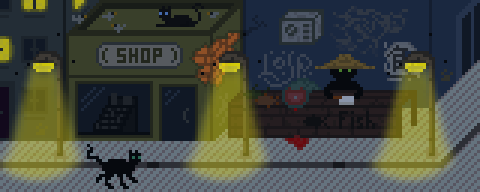
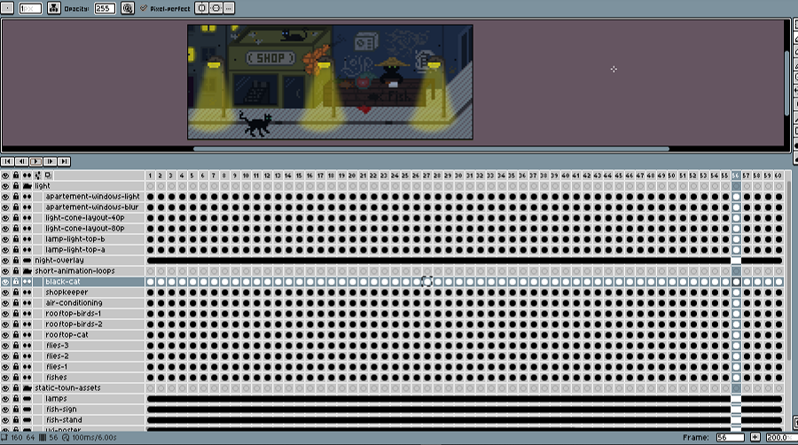
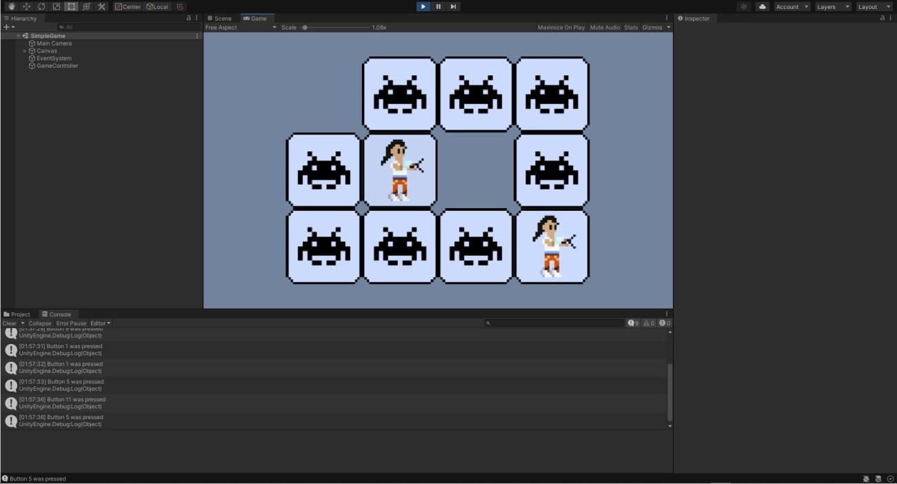
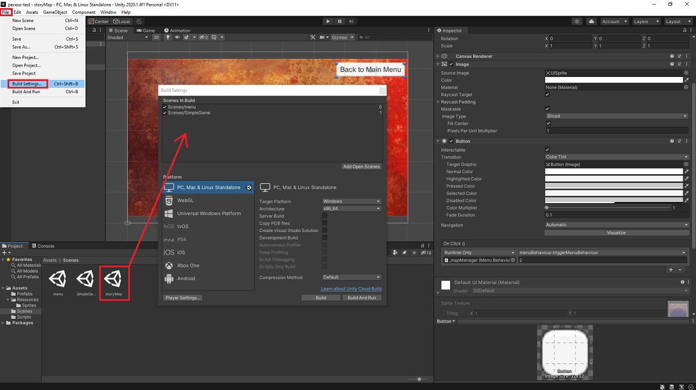

Dokončení obrázku a animace z minulého blog postu. Menší pokrok s hrou. A pár tipů do Aseprite a Unity.

## Cat Alley - animace

**Kočičí ulička**. První větší počin, který se mi podařilo dotáhnout až do finální fáze. Plátno 160x64 px, do článku 3x zvětšeno na 480x192 px. 60 framů. 8 animovaných objektů. Cca 10 hodin práce.[^1]



### Poznámky a zajímavosti k animaci

Aminace by snesla ještě mnohem více péče. Například kočka na ulici je v divné póze, protože měla původně chodit. To by ovšem vyžadovalo hromadu práce navíc, kterou chci dát novému projektu.

Z původního konceptu (na obrázku níže) zmizely lampiony. Prodavač ovoce a zeleniny se změnil na tajuplného obchodníka z rybími pochoutkami.


Finální verze animace má 60 framů a přes 20 vrstev. Není už úplně sranda se v tom vyznat.



Na modré budově za třetí lampou je potrhaný plakát s čínským znakem "Yú", který znamená "ryba". Níže v původní podobě.


## GameDev - Memory Game

Zkušební hra dostala funkční menu, mapu levelů a základní navigační prvky napříč obrazovkami, plus možnost normálního ukončení hry. Prodlevy po otočení karet jsou zkrácené na polovinu. Svižnost je znát. Samotná hra je pořád stejně špatná.

Druhý build ke stažení: [pexeso-demo-v2_3.zip](../assets/post-img/2020-09-21-pixel-art-vi/pexeso-demo-v2_3.zip "pexeso-demo-v2_3.zip") (21 MB). Rozbalit a spustit souborem ```pexeso-test.exe```.



## Aseprite Tips & Tricks

**Vrstvy**. Na začátku nejsou moc důležité, ale postupně je potřeba přesouvat všechny jednotlivé prvky do vrstev. Každý i drobný objekt by měl být nezávislý na celku. Například větrák, obě grafitti či plakát na modré budově jsou separátní objekty.

**Animovat až na konec**. Nedává vůbec žádný smysl se pokoušet o animaci v rané fázi kresby. Nejdříve je potřeba dokončit a řádně rozvrhnout celý obrázek a animaci řešit až jako poslední fázi. Upravovat základní grafiku v této fázi je totiž velmi náročné a zdlouhavé.

**Export do WebP**. Problém (animovaných) gifů je limit 256 barev na jeden snímek. Při použití gradientů, práci s alfa kanálem (průhlednost) nebo blur toolem vzniká zatraceně hodně barev nad uvedený limit. Exportovací algoritmus do gifu si s tím neumí správně poradit a začne na každém snímku nastavovat rozdílné barvy. Elegantní řešení je export do bezztrátového formátu WebP, který umí animaci, zvládne pobrat všechny barvy a ještě vygeneruje podstatně menší soubor. Gif by měl 1,25 MB. WebP má jen pouhých 44 KB.

## Unity Tips & Tricks

Unity sice vypadá na první pohled docela jednoduše. Tutoriálů jsou všude mraky. Ne všechno je však zrovna user-friendly. Programování je potřeba víc, než jsem původně čekal a C# není něco co bych si užíval. Pár tipů pro odvážlivce a začátečníky.

### Debugging

Debugging se v Unity dělá pomocí ```Debug.Log();```. Pokud debugging nefunguje je vhodné zkusit použít zápis ```UnityEngine.Debug.Log();```.

Problém s debuggingem poznáte podle hlášky ```error CS0104: 'Debug' is an ambiguous reference between 'UnityEngine.Debug' and 'System.Diagnostics.Debug```.

V Unity 2019.3 ještě ```Debug.Log();``` fungoval. V Unity 2020.1 už pouze s UnityEngine.

### Chybová hláška - Scene couldn't be loaded

Pokud vidíte níže uvedenou chybovou hlášku zkuste omrknout Build Settings. Nové scény je nutné přidat manuálně do buildu.

```Scene 'storyMap' couldn't be loaded because it has not been added to the build settings or the AssetBundle has not been loaded. To add a scene to the build settings use the menu File->Build Settings...```



## Závěr

Od pixel artu si dám nejspíš menší pauzu a zkusím dotáhnout hru do trochu použitelnější podoby.

[^1]: test poznámky
