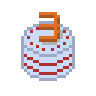

Rekapitulace prvních tří let na volné noze. Stát se freelancerem byla skvělá volba a chci se podělit o pár zkušeností, protože podobné články mi hodně pomohly v začátcích.

## Proč volná noha

Rok 2017 se nesl ve znamení velkých a ne zrovna příjemných změn v agentuře, kde jsem pracoval. Krom toho jsem se dlouhodobě nikam neposouval profesně a cítil potřebu dělat něco smysluplnějšího.

Co dál? Přesun do jiné agentury jsem zavrhl hodně rychle. Po zkušenostech s několika korporáty jsem nechtěl dělat ani pro velké firmy. Malé firmy a startupy většinou nepředstavovaly zajímavé pracovní výzvy. Takže volná noha byla jediná přijatelná volba.

Významnou motivací byla touha po **svobodě**. Chtěl jsem mít možnost sám rozhodovat co, jak a pro koho budu dělat. Řídit svůj čas a procesy tak, aby to vyhovovalo potřebám mým a mých klientů. Svoboda je naprosto nedocenitelný benefit. To vám řekne snad každý freelancer a je to pravda.

Druhou motivací byly **peníze**. Uvědomil jsem si, že když zvládám prodat svoji agenturní práci velkým klientům, tak to musím zvládnout i na volné noze. Neexistuje žádný relevantní důvod, proč se spokojit s "desátkem" v podobě agenturní výplaty.

Třetí motivací bylo mít **smysluplnou práci**. Agentura byla po čase nudná rutina. Posílat klientům každý měsíc desítky urgencí a dělat pořád dokola audity podle stejné šablony není zrovna naplňující.

## Jak to proběhlo

Na volnou nohu jsem se připravoval něco přes 6 měsíců. Na jaře 2017 jsem si udělal nový profesní web [https://chaoticum.cz](https://chaoticum.cz). A začal jsem s lidmi v okolí otevřeně mluvit o tom, že zvažuji přechod na volnou nohu.

Od zaměstnavatele jsem si nechal podepsat **žádost k udělení souhlasu k jiné výdělečné činnosti**. Tedy, že mohu legálně vykonávat vedlejší výdělečnou činnost, shodnou s předmětem podnikání zaměstnavatele. Toto jsem nakonec ani nepotřeboval, ale kdyby mi přišla ještě v průběhu zaměstnání nějaká zajímavá zakázka, tak bych ji bez souhlasu nemohl dělat.

Krátce na to jsem dal výpověď z agentury. Informaci o přesunu na volnou nohu jsem oznámil na sociálních sítích, díky tomu se mi ozvali první klienti.

**Živnostenské oprávnění** jsem si vyřídil 1. 12. 2017 v Brně. Místo plánované dovolené jsem celý prosinec jezdil na pracovní schůzky a hned od ledna odbavoval první zakázky. A nastoupil jsem do [Heureky](https://www.heureka.cz/), kam mě dohodil [Filip Podstavec](https://www.podstavec.cz/). Bez včasného plánování a kontaktů bych začal naplno pracovat minimálně o 3-4 měsíce později.

## Co mi pomohlo

Z agenturní praxe jsem si odnesl spoustu užitečných návyků, znalostí, zkušeností z praxe a hlavně kontaktů. Obrovská výhoda byla, že jsem několikrát přednášel na akcích jako **SEO restart** a **SEOloger**. Publikoval jsem i pár odborných článků. Díky tomu jsem byl trochu vidět a dalo mi to dost zásadní náskok. Schopnost zviditelnit se je podle mě důležitá.

Přednášky jsou pro mě, jakožto introverta, hodně nepříjemným krokem ven z komfortní zóny. Články zase zaberou spoustu času. Ale jsou to jedny z nejefektivnějších cest sebepropagace. Podobné aktivity ale dělám jen občas a snažím se jít spíše cestou odbornosti než tlaku na osobní brand.

Dlouhodobě nejspolehlivěji funguje dělat kvalitní práci. Spokojení klienti mě doporučí někomu dalšímu. Většinou podobně smýšlejícímu člověku ze stejné sociální bubliny. Díky tomu mám zpravidla hned od začátku jistotu dobrého porozumění a funkční spolupráce.

## Co mi nepomohlo

**Web**. V pohodě bych bez něj mohl žít a fungovat. Je to aktuálně spíš taková online vizitka, kterou chci výrazně přepracovat. Momentálně je pro mě podstatně užitečnější mít vyladěný [LinkedIn](https://www.linkedin.com/in/zdeneknespor/).

**Zápis v oborovém katalogu**. Sice generoval poptávky, ale z 99 % extrémně nízké kvality. Co slýchám, tak to platí o většině katalogů.

**Klasické vizitky**. V digitálních oborech jsou přežitek. Za tři roky jsem je ani jednou nepotřeboval a naštěstí si je ani nenechal vytisknout. Jen škoda času stráveného nad jejich designem.

**Online diskuze**. Je hrozně jednoduché podlehnout sociálním sítím a disinhibici. Rozdávat lidem rady zadarmo nebo marnit čas zbytečnými hádkami je k ničemu. Tuto aktivitu jsem výrazně utlumil.  

## Změny v pracovních postupech

Původně jsem si hrozně růžově maloval, že budu mít nějakou šablonu na analýzy webů a audity budu sekat jeden za druhým. Nikdy jsem to nerealizoval a už ani nechci. Rychle jsem zjistil, že práce podle sebelepší šablony mě nebaví. Klientům žádný velký užitek nepřináší a šablonovitá práce až příliš často končí v zapomenutá někde v marketingovém šuflíku.

Všechno připravuji na míru pro konkrétní klienty s důrazem na maximální efektivitu, rychlost a přínos. Klientům to přináší možnost investovat finance do skutečného rozvoje webu a ne do dokumentu o 30 stranách.

Snažím se reflektovat celý rozsah klientského byznysu. Většina webů k rozvoji nepotřebuje drahý technický SEO audit, ale spíše rychle opravit největší chyby a jasný směr kam přesně nalít peníze a úsilí, aby to přinášelo efekt.

## Práce zadarmo neexistuje

V prvních dvou letech jsem si vytipoval pár zajímavých lidí a projektů, které mě zaujaly a neměly dostatek financí na profi konzultanta. Poskytoval jsem bezplatnou podporu, konzultace i správu webu. Zájem byl velký. Výsledky téměř nulové.

Konzultací zdarma si většina lidí moc nevážila a rady stejně ignorovali. Veškerou aktivitu tohoto typu jsem utlumil. Totéž platí o různých diskuzních skupinách na sociálních sítích. Svůj čas a odborné znalosti nedávám k dipozici zdarma.

## Tři roky failů a úspěchů

V opojení z nabyté svobody a přívalu zajímavých zakázek jsem v prvním roce nezvládal klienty odmítat. CRMko jsem měl plné, poznával jsem hromadu nový lidí a všechno bylo parádní. Vymstilo se mi to docela rychle. Práci jsem nezvládal odbavovat a dostavila se první krize.

Těch krizí nakonec přišlo víc v roce 2018 i 2019. Agenda vyrostla do obludných rozměrů. Smršt meetingů, extrémně komplikovaných analýz a stresu byla pekelná. Spoustu klientů jsem vyfailil a nezvládal dlouhodobě komunikaci. Bohužel není reálné pracovat od rána do noci, dovolenou nevyjímaje, na náročných webech a zvládnout to ve zdraví a příčetnosti. V půlce roku 2019 jsem se rozhodl pro zásadní změnu. Rozplánoval jsem a rozjel ukončování většiny spoluprací.

Rok 2020 díky tomu byl zatím nejlepší. S výjimkou několika drobných jednorázových konzultací jsem ho celý dedikoval výhradně Heurece.

S kolegou Luďkem Pulicarem se nám podařilo udělat unikátní [SEO livestream](https://www.heurekadevs.cz/pozvanka-na-prvni-seo-livestream/) přes Twitch (náhrada za přednášku na zrušené Google Webmaster konferenci v Brně), publikovat dva velké články ([Chaos přichází plíživě](https://www.heurekadevs.cz/satan-seo-subdomeny-i-chaos/), [Protinádorová SEOterapie](https://www.heurekadevs.cz/satan-seo-subdomeny-ii-seoterapie/)) a vyhrát soutěž [WebTop100 v kategorii SEO](https://www.heurekadevs.cz/webtop100-2020-seo/).

Po dlouhé odmlce jsem publikoval dva nové bezplatné nástroje [URL Regexator](https://link-brain.com/tools/url-regexator/) a [Robots.txt Multiline Validator](https://link-brain.com/tools/robots-txt-multiline-validator/).

Restartoval jsem tento blog. Vyzkoušel jsem si tvorbu pixel artu a vývoj her v Unity. Plus zkouším rozjet ještě vlastní e-commerce projekty.

## Klíčové nástroje a pomůcky na volné noze

Soupiska nejdůležitějších věcí a nástrojů, které mi pomáhají v práci a podnikání.

### Software

**Google Workspace** (dříve G Suite). Dlouhodobě využívám Google služby, takže pořízení G Suite byla jasná volba. Správu účtu a fakturaci mám převedenou pod firmu [AppSatori](https://www.appsatori.eu/).

**Trello**. Používám jako CRM, na evidenci projektů, úkolů a poznámek. Všechno potřebné se mi podařilo vtěsnat na jeden board. Minimalistický systém mi šetří hromadu administrativy. Vystačím si s bezplatnou verzí.

**Fakturoid**. Geniální nástroj na fakturaci. Jednoduchý, přehledný a efektivní. Nikdy bych nečekal, že si něco takového oblíbím. Moje nejdůležitější a nejlepší investice.

**Clockify**. Trackování času. Původně jsem používal Toggl, ale nějak mi nesedl redesign laděný do růžové a fialové barvy. Trochu nucený přechod na Clockify se vyplatil, nástroj je v pár ohledech lepší. Také mi stačí free režim.

### Hardware

**Roční diář Leuchturm 1918**. Před pár roky jsem si oblíbil klasické papírové diáře. Leuchturm 1918 patří mezi absolutní špičku. I sebekvalitnější papírový diář sice postrádá flexibilitu Google kalendáře, například při změnách termínů schůzek, ale papír má prostě svoje neodolatelné kouzlo.

**Sluchátka Sony WH-1000XM3**. Jedny z nejlepších sluchátek na trhu s technologií aktivního potlačení okolního hluku. Nedocenitelné při častém cestování nebo v open space. Spolehlivě odbourá jakýcholiv ruch. Neumí dobře odbourávat lidský hlas, ale s puštěnou hudbou ani to nebývá problém.

**Myš Logitech MX Master 3 Advanced**. Moc lepších myší na trhu nenajdete. Skvělé je především elektromagnetické scrollovací kolečko, které umožňuje na jedno zascrollování projet až několik tisíc řádků v tabulkách nebo velkých dokumentech. Produkty z řady MX Master jsou naprosto excelentní.

**Klávesnice Logitech MX Keys**. Příjemná vysoce kvalitní klávesnice notebookového typu. Důležité pro mě je, že myš i klávesnice jsou kompatibilní a podporují technologii Logitech Flow. To mi umožňuje zároveň pracovat na dvou počítačích a plynule mezi nimi přecházet.

**ASUS TUF Gaming FX504GM-E4233T**. Výkonný a hlavně upgradovatelný laptop. Bez problémů utáhne náročný software a procesy. A občas se hodí mít výkonný stroj se kterým se dá i cestovat. Další podobný notebook už ale kupovat neplánuji a půjdu do klasického stolního PC.

**Tablet PC ASUS ZenBook Flip 13 UX362FA-EL151T**. Malý a lehký laptop na cestování. Musel jsem si ho pořídit v roce 2020, když jsem musel výše uvedený notebook poslat na několik týdnů do servisu.

**Tiskárna a ruční skartovačka**. Využívám minimálně, ale tisknout smlouvy a daňová přiznání do veřejného copycentra chodit nechcete. Skartovačka je skvělá na likvidaci citlivých dokumentů.

Chvíli jsem koketoval s koupí Macbooku. Ale nedávalo mi to žádný smysl. Konkurenční produkty mají lepší nebo shodné technické parametry za výrazně nižší cenu. Za cenu Macbooku s adekvátními parametry pro SEO práci se dá pořídit spousta užitečnějších věcí.

## Sdílené kanceláře

Pár měsíců jsem si platil sdílené místo v ostravském coworkingu Impact Hub. Na chvíli jsem se přesunul v Hubu i do sdílené kanceláře.

Otevřený prostor nebyla moc dobrá volba z mnoha důvodů. Spousta lidí nerespektovalo základní pravidla. Na práci potřebuji maximální soustředění a přestal mi vyhovovat ruch v blízkosti sdílených míst.

Sdílená kancelář bohužel nakonec taky moc klidná nebyla. A hlavně pronájem byl zatraceně drahý. Vycházelo to tuším na nějakých 15.000 Kč za čtvrtletí. Zvolil jsem proto cestu domácí kanceláře, kterou jsem si ani ne za cenu čtvrtletního pronájmu místa v Hubu vybavil velkým polohovatelným Ikea stolem a fajn židlí.

## Cestování

Za roky 2018 a 2019 jsem najezdil **vlakem kolem 25.000 kilometrů** a spal přibližně ve 20 hotelech. Nejvíc jsem toho nacestoval z RegioJetem. Je nejlevnější, jezdí často a má relativně dobrou wifi dostačující pro jednoduchou práci. LEO Express je nesmyslně drahý a nemá zrovna kvalitní wifi. České dráhy, respektive Pendolino, jsou přijatelná nouzovka, třeba když upadne RegioJetu na nádraží kus nápravy (není vtip).

**Hotely** by vydaly na několik článků. Zažil jsem dost fascinující praktiky. Penzion, který navzdory funkčnímu terminálu odmítl přijmout platbu kartou. Apartmán, kde po zaplacení ubytování vyžadovali ještě zaplatit zálohu 1000 Kč nebo si oskenovat občanku a platební kartu. Penzion, co účtoval pobyt v Eurech a pak přepočítával na koruny podle univerzálního šmejdo-kurzu €1 = 28 Kč (reálný kurz byl o cca tři Kč nižší). Rádoby lepší hotel, kde byly na pokoji prasklé žárovky, plíseň, mravenci a netekla teplá voda. Prostě spousta intenzivních zážitků. Ale to jsem už hodně odbočil.

Ještě dodám, že na cestování jsem si koupil **batoh Victorinox Altmont Professional Fliptop**. Skvělý batoh, do kterého se dá v pohodě sbalit až na dva dny (pokud cestujete nalehko jako já). Můžu vřele doporučit.

## Daně a úřady

Obavy z papírování, úřadů a daní mě dlouho odrazovaly od freelancingu. Ale není se čeho bát. Agenda není nijak zvlášť složitá. Daňové přiznání a přehledy OSVČ zaberou ročně jeden večer práce. Základ zvládne skvěle vygenerovat **Fakturoid**.

Musím říct, že v pojišťovně i České správě sociálního zabezpečení byli všichni naprosto v pohodě. Stačí všechno platit včas a nechovat se k úředníkům jako hovado. Výjimka je finanční úřad, který působí jako instituce, kde se zastavil čas. Ale pokud pominu absenci jakéhokoliv náznaku ochoty, tak ani tam jsem nenarazil na větší problém.

Na věci, se kterými jsem si na začátku nevěděl rady, jsem si zaplatil konzultaci u Zuzany Bartůškové z [BKP FINANCE](https://www.bkpfinance.cz/).

## Finance

Finance řeším velmi striktně. Mám založený samostatný "podnikatelský" běžný účet u AirBank. Všechny příchozí a odchozí transakce spojené s podnikáním se dějí pouze z tohoto účtu. K tomu si vedu jednoduchý **finanční přehled v Google Sheets**, kde si můžu vyjet například soupis zaplaceného zdravotního pojištění nebo výdaje na hardware. Každý měsíc si převádím jasně stanovenou částku na osobní účet pro běžnou útratu. A na "podnikatelském" účtu si buduji železnou rezervu na případy nouze, náhlé výdaje spojené s podnikáním, daně a podobně.

Tohle už bylo napsané snad v každém článku o volné noze. Někdo z toho bývá překvapený, takže opakování asi nezaškodí. Jako freelancer nemáte sick days, placené volno, firemní Mac a iPhone, služební auto, jistotu práce, pojištění, odstupné když vás vyrazí a tak dále. Všechno si platíte sami. Výdaje se pohybují do 10.000 Kč měsíčně (zdravotní a sociální pojištění, podnikatelské nástroje, atd.). Pokud si platíte nějaké lepší SEO nástroje, hodně cestujete, chcete jít na konferenci či školení, tak se jednoduše dostanete i na 20.000 Kč. A to už není úplně málo. Dovolená pak znamená období nulového příjmu.

Je naprosto klíčové pracovat s osobními a podnikatelskými financemi odděleně a mít neustále odložený dostatečný objem peněz. Minimum je na půl roku fungování bez příjmu. Za hodně důležitý nástroj v této oblasti považuji [finanční plán podle šablony od Roberta Vlacha](https://navolnenoze.cz/blog/financni-plan/).

## Pár mých zásad a tipů

* Neúčastním se velkých tendrů. Vypisují je převážně velké korporace, se kterými se špatně spolupracuje. Ze zkušenosti vím, že příprava takových nabídek je časově nákladná. A tendr navíc často vyhraje cíleně podstřelená nabídka.
* Automaticky odmítám zakázky, které se mi z jakéhokoliv důvodu nelíbí. Dám na svoji intuici. Pokud mi přijde, že někde něco smrdí, tak raději odmítám.
* Nespolupracuji s nikým, kdo podniká nelegálně, vydělává na lidském neštěstí (půjčky), závislostech (tabák, hazard), šíří dezinformace nebo jakkoliv cíleně odrbává své zákazníky. Podnikám férově a podporuji jen další férové podnikatele a firmy.
* Pokud se na zakázce do týdne nedomluvíme, tak to většinou vůbec nevyjde nebo je následná spolupráce neuspokojivá. S těmi nejlepšími klienty jsme se zvládli domluvit do druhého dne od první schůzky.
* Snažím se jednat primárně s decision makery - CEOs, majitelé firem, vedoucí oddělení. Manažer někde ve třetí linii, obvykle nemá dostačující rozhodovací pravomoce, aby realizoval nějakou smysluplnou práci, natož aby mě najal.
* Fakturuji férově a primárně za odbornou práci. Nedělám zbytečné úkony, minimalizuji administrativu, uměle nenavyšuji finální cenu. Nedělám činnosti, které klientovi nijak nepomůžou. Odmítám dělat práci, kterou dokáže udělat podstatně levněji brigádník nebo junior z agentury.
* Nedělám outsourcing odborné práce. Občas využiju výpomoc se sběry dat, ale nikdy práci brigádníka neprodávám za svoji hodinovku.
* Raději udělám 80 hodin skvělé práce než 160 hodin průměrné.

## Užitečné zdroje

V začátcích mi pomohly články jiných freelancerů ze stejného oboru, ve kterých otevřeně sdíleli svoji cestu. Například články Pavla Ungra [Odcházím z H1.cz](https://www.pavelungr.cz/odchazim-z-h1-cz/) a [Co mi daly a vzaly 2 roky na volné noze](http://free.lance.cz/co-mi-dal-a-vzal-rok-na-volne-noze/).

Vřele doporučuji podnikatelské [rozhovory Na volné noze](https://www.youtube.com/channel/UCpATJC1rBtKppd68xwKjeog) a knihu **Na volné noze** od **Roberta Vlacha**. Za poslech stojí i rozhovory Jiřího Rosteckého z [Mladého podnikatele](https://mladypodnikatel.cz/video). A pokud se pohybujete v oblasti tvorby webů, tak ještě doporučím [knihu Web ostrý jako břitva](https://www.houseofrezac.com/kniha) od Honzy Řezáče. Není nic jednoduššího než se inspirovat úspěchy a zkušenostmi jiných a poučit se z jejich chyb. Tyto zdroje jsou naprosto nedocenitelné.

Pár jmen freelenacerů a podnikatelů, kteří mě inspirují (abecední pořadí):

* [Adam Zbiejczuk](https://about.me/zbiejczuk)
* [Lukáš Pítra](https://www.lukaspitra.cz/)
* [Ondřej Staněk](https://www.stanekconsulting.cz/)
* [Pavel Minář](https://www.minar.cz/)
* [Pavel Ungr](https://www.pavelungr.cz/)
* [Robert Vlach](http://www.vla.ch/)

## První freelance pokusy

V letech 2011-2013 snažil uchytit jako video editor, grafik a kodér. Za videa jsem v lepších případech dostával zaplaceno 3000 Kč za kus. Produkce trvala občas i přes týden a finančně to vycházelo přibližně 40 Kč na hodinu.

S weby jsem si moc nepolepšil. Nacenění jsem těžce střílel od boku a klienti nebyli zrovna zámožní. Nejdražší web jsem udělal za 5000 Kč. Problém byl, že jsem na tom strávil 150 hodin práce, což vychází na příšerných 33 Kč za hodinu.

Osobně bych doporučil na volné noze nezačínat. Pokud jste schopní, tak bohatě stačí strávit 3-4 roky v nějaké agentuře. Získáte kontakty, praxi, pochopíte jak některé věci chodí. Většina agenturních konzultantů se za 3 roky jednoduše dostane na úroveň lidí, kteří podnikají klidně i 10 let, ale na volné noze rovnou začali. Ideální jsou agentury v Praze nebo Brně, kde aktivně působí nadprůměrně schopní specialisté, od kterých se nejvíc naučíte.

## Cesta k SEO

Trocha nostalgie na závěr. Honza Tichý (toho času působící v H1) měl 19. března 2009 měl na Filozofické fakultě v Brně přednášku na téma "Optimalizace pro vyhledávače". Celý ten obor mě absolutně nadchnul. Tenkrát jsem naprosto přesně věděl, že SEO v H1 je práce, kterou chci někdy dělat.

Ironií osudu jsem časem získal práci v korporátu na Smíchově. Ve stejné budově, kde o dvě patra výš sídlila H1. Korporátní šílenství nebylo nic pro mě. V roce 2014 jsem se přesunul do agentury Medio Interactive, kterou založil právě Honza Tichý. Dream job (alespoň na pár let).

Než jsem se dostal na finální pozici, tak jsem během pár měsíců oslovil přes 85 firem. H1 jsem zkoušel třikrát, dvakrát mi ani neodpověděli a nevzali mě ani jako brigádníka na recepci. Cesta k SEO juniorovi mi trvala 5 let. Nehrálo v tom žádnou roli štěstí, osud nebo cokoliv jiného. Prostě jsem to nevzdal a makal na sobě.

## Závěr

Volná noha je skvělá a těším se na další tři roky. Díky, pokud jste dočetli až sem.
